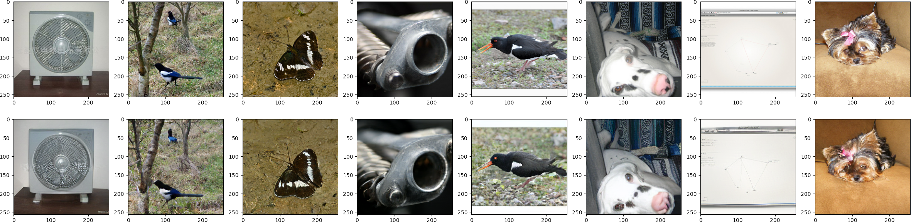
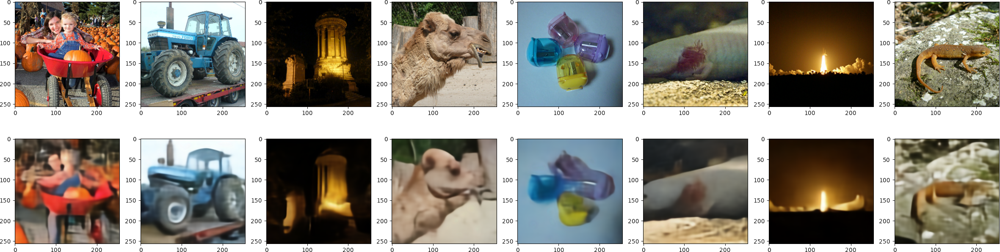
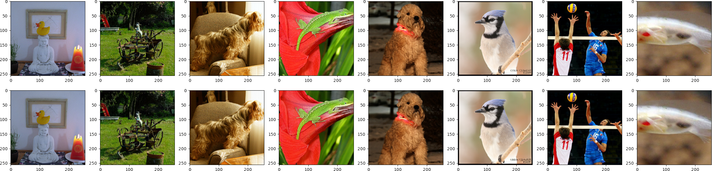
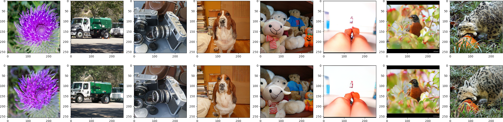

# jax-vqvae-vqgan
JAX implementation of VQVAE/VQGAN autoencoders (+FSQ). Adapted largely from [MaskGIT repo](https://github.com/google-research/maskgit). This code was tested on TPU-v3 pods. We can succesfully reproduce results from VQGAN and FSQ papers.

### Installation
First install the dependencies in `environment.yml`.
Then, you will need to download some auxilliary files, specifically a pretrained Resnet (for perceptual loss) and Inception (for FID calculation)
```
wget -p data/ https://github.com/kvfrans/jax-fid-parallel/raw/main/data/imagenet256_fidstats_openai.npz
gsutil cp gs://gresearch/xmcgan/resnet_pretrained.npy data/
```
You will also need to get the [TFDS Imagenet dataset](https://www.tensorflow.org/datasets/catalog/imagenet2012) (or use your own dataloader).

### Usage
To replicate some results, here are some useful commands:
```
# VQVAE
python train.py --wandb.name VQVAE --dataset_name imagenet256 --model.g_adversarial_loss_weight 0 --model.perceptual_loss_weight 0
# VQGAN
python train.py --wandb.name VQGAN --dataset_name imagenet256
# VQGAN (KL regularizer)
python train.py --wandb.name VQGAN-KL --dataset_name imagenet256 --model.quantizer_type kl
# VQGAN (FSQ regularizer)
python train.py ---wandb.name VQGAN --dataset_name imagenet256 --model.embedding_dim 4 --model.quantizer_type fsq
```
Details:
- VQGAN is equivalent to VQVAE, except that we have two auxilliary losses, an LPIPS perceptual loss and the Discriminator loss.
- KL regularizer does not use any VQ bottleneck, but just regularizes a continuous bottleneck with KL divergence from the unit gaussian. It's just a classical VAE. Notably, Stable Diffusion uses a VAE of this form.
- [Finite Scalar Quantization](https://arxiv.org/abs/2309.15505) (FSQ) is an aternative to VQ that uses rounding instead of a codebook lookup.
- By default, we compress images by 16x. This means a `[256, 256]` image becomes a `[16, 16]` latent vector.
- VQ methods use codebook of 1024, embedding size of 256. FSQ uses embedding size of 4, with 5 bins. `4^5 = 1024`

You can evaluate models using the `eval_fid` command. 

| Data              | FID (ours) | FID (reference paper) |
| :---------------- | :------: | ----: |
| VQGAN     |  6.17   | 7.94  ([VQGAN](https://arxiv.org/abs/2012.09841))|
| VQVAE     |  88.11  | N/A |
| VQGAN-KL  |  3.31   | N/A |
| VQGAN-FSQ |  7.29   | ~7.5 ([FSQ](https://arxiv.org/abs/2309.15505)) |

## Examples
(top row = real images, bottom row = reconstruction)

VQGAN


VQVAE


VQGAN-KL


VQGAN-FSQ

